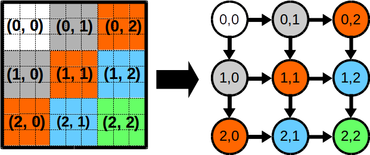
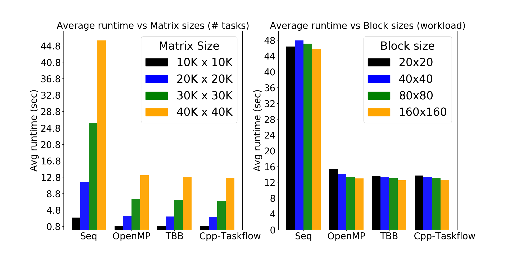

# Wavefront Computation

We demonstrate in this page how to implement a wavefront computation workload 
using Cpp-Taskflow. 
An example of the wavefront pattern is shown below.



We partition a given 2D matrix into a set of identical square blocks (sub-matrices).
Each block is mapped to a task that performs a linear scan through each element
coupled with a fixed set of arithmetic operations.
The wavefront propagates the dependency constraints diagonally 
from the top-left block to the bottom-right block. 
In other word, each block precedes two blocks, one to the
right and another below. 
The blocks with the same color can run concurrently.

We consider a baseline sequential program and 
compare with three parallel implementations with Cpp-Taskflow, OpenMP, 
and Intel Thread Building Blocks (TBB).

+ [Cpp-Taskflow](#cpp-taskflow)
+ [OpenMP](#openmp)
+ [Intel Thread Building Blocks (TBB)](#intel-thread-building-blocks)
+ [Debrief](#debrief)

# Cpp-Taskflow

```cpp 
1:  // MB, NB: number of blocks in the two dimensions. B: dimension of a block
2:  // matrix: the given 2D matrix   
3:  // tasks: the placeholders for tasks in Taskflow
4:  // tf: Taskflow object
5:  void wavefront(size_t MB, size_t NB, size_t B, double** matrix, std::vector<std::vector<tf::Task>>& tasks, tf::Taskflow& tf){ 
6:    for(int i=MB; --i>=0;) { 
7:      for(int j=NB; --j>=0;) { 
8:        task[i][j].work([=]() {
9:          block_computation(matrix, B, i, j); 
10:       });  
11:       if(j+1 < NB) {
12:         task[i][j].precede(task[i][j+1]);
13:       }
14:       if(i+1 < MB) {
15:         task[i][j].precede(task[i+1][j]);
16:       }
17:     } // End of inner loop
18:   } // End of outer loop
19:
20:   tf.wait_for_all();
21: }
```
This function shows the wavefront computing implemented using Cpp-Taskflow. We
delegate each block to a `tf::Task` and use the `precede` function to specify
the dependency between tasks. The `tf.wait_for_all()` blocks until all tasks finish.

# OpenMP 

```cpp
1:  // MB, NB: number of blocks in the two dimensions. B: dimension of a block
2:  // matrix: the given 2D matrix 
3:  // D: dependency matrix 
4:  void wavefront(size_t MB, size_t NB, size_t B, double** matrix, int** D){
5:    omp_set_num_threads(std::thread::hardware_concurrency());
6:    #pragma omp parallel
7:    {
8:      #pragma omp single
9:      {
10:       for(int i=0; i<MB; i++){
11:         for(int j=0; j<NB; j++) {
12:           if(i > 0 && j > 0){
13:             #pragma omp task depend(in:D[i-1][j], D[i][j-1]) depend(out:D[i][j]) firstprivate(i, j)
14:             block_computation(matrix, B, i, j);
15:           }
16:           // Top left corner
17:           else if(i == 0 && j == 0){
18:             #pragma omp task depend(out:D[i][j]) firstprivate(i, j)
19:             block_computation(matrix, B, i, j);
20:           }
21:           // Top edge  
22:           else if(j+1 <= NB && i == 0 && j > 0){
23:             #pragma omp task depend(in:D[i][j-1]) depend(out:D[i][j]) firstprivate(i, j)
24:             block_computation(matrix, B, i, j);
25:           }
26:           // Left edge
27:           else if(i+1 <= MB && i > 0 && j == 0){
28:             #pragma omp task depend(in:D[i-1][j]) depend(out:D[i][j]) firstprivate(i, j)
29:             block_computation(matrix, B, i, j);
30:           }
31:           // Bottom right corner
32:           else{
33:             #pragma omp task depend(in:D[i-1][j] ,D[i][j-1]) firstprivate(i, j)
34:             block_computation(matrix, B, i, j);
35:           }
36:         } // End of inner loop
37:       }  // End of outer loop
38:     } // End of omp single 
39:   } // End of omp parallel 
40: }
```

This function shows the wavefront computing implemented using OpenMP. Each
block is delegated to a OpenMP task. 
Since the OpenMP task dependency clause is *static*,
we need to create an additional dependency matrix `D` 
and use it to explicitly specify both input and output task dependencies.


# Intel Thread Building Blocks

```cpp 
1:  using namespace tbb;
2:  using namespace tbb::flow;
3:  
4:  // MB, NB: number of blocks in the two dimensions. B: dimension of a block
5:  // matrix: the given 2D matrix   
6:  // nodes: the nodes in flow graph
7:  // G: Intel-TBB flow graph
8:  void wavefront(size_t MB, size_t NB, size_t B, double** matrix, continue_node<continue_msg> ***nodes, Graph& G){ 
9:   for(int i=MB; --i>=0;) { 
10:     for(int j=NB; --j>=0;) {
11:       node[i][j] = new continue_node<continue_msg>(G,
12:         [=](const continue_msg&) {
13:           block_computation(matrix, B, i, j); 
14:       });
15:       if(i+1 < MB) {
16:          make_edge(*node[i][j], *node[i+1][j]);
17:       }
18:       if(j+1 < NB) {
19:          make_edge(*node[i][j], *node[i][j+1]);
20:       } 
21:     } // End of inner loop
22:   } // End of outer loop
23:  
24:   nodes[0][0]->try_put(continue_msg());
25:   G.wait_for_all();
26: }
```

This function shows the wavefront computing implemented using Intel-TBB flow graph. We 
build a dependency graph using the `continue_node` type in TBB flow graph and delegate 
each block to a node. The `make_edge` function specifies the dependency between two nodes 
and calling `wait_for_all` waits until all computations complete.


# Debrief

We evaluate our implementations on a 
Linux Ubuntu machine of 4 Intel CPUs 3.2GHz and 24 GB memory. 

## Software Cost

We use the famous Linux tool [SLOCCount][SLOCCount] to measure the software cost of
each implementation.
The cost model is based on the *constructive cost model* (COCOMO).
In the table below, **SLOC** denotes souce lines of code, 
**Dev Effort** denotes development effort estimate (person-months),
**Sched Estimate** denotes schedule estimate (years),
**Developers** denotes the estimate number of developers,
**Dev Cost** denotes total estimated cost to develop.
All quantities are better with fewer values.

| Task Model   | SLOC | Dev Effort | Sched Estimate | Developers | Dev Cost |
| ------------ | ---- | ---------- | -------------- | ---------- | -------- |
| Sequential   | 55   | 0.01       | 0.09           | 0.10       | $1,285   |
| Cpp-Taskflow | 78   | 0.01       | 0.10           | 0.13       | $1,855   |
| OpenMP 4.5   | 109  | 0.02       | 0.12           | 0.16       | $2,636   |
| Intel TBB    | 87   | 0.02       | 0.11           | 0.14       | $2,080   |

The sequential program obviously has the least software cost.
In terms of parallel implementations,
Cpp-Taskflow is the most cost-efficient compared with OpenMP and TBB.
Our task model facilitates the implementations of parallel decomposition strategies
and algorithms.

## Performance

We alter the matrix size and the block size
to compare the performance between the sequential program, Cpp-Taskflow, OpenMP, and Intel TBB.
For the first
experiment, we fix the block size to 100x100 and test four matrix sizes:
10Kx10K, 20Kx20K, 30Kx30K and 40Kx40K. 
For the second experiment, we fix the
matrix size to 40Kx40K and test four block sizes: 20x20, 40x40, 80x80 and 160x160.



The left figure shows the first experiment under different matrix sizes and
the right figure shows the second experiment under different block sizes.
In general,
both Cpp-Taskflow and TBB outperforms OpenMP.
TBB is the fastest across all benchmarks but the performance margin to Cpp-Taskflow
is only about 1-5%.
We believe the slowness of OpenMP attributes to the static property of its dependency clauses.
We need to explicitly specify all possible dependency constraints
in order to cover all conditions.
This gives rise to a number of if-else and switch statements
that can potentially slow down the runtime.

## Remark

We expect TBB to be a bit faster than Cpp-Taskflow as the flexibility and programmability
of our graph model takes a few overhead - there is no free lunch!
However, the performance difference between Cpp-Taskflow and TBB is very tiny
in this workload.


* * *

[GraphvizOnline]:        https://dreampuf.github.io/GraphvizOnline/
[Intel Developer Zone]:  https://software.intel.com/en-us/blogs/2011/09/09/implementing-a-wave-front-computation-using-the-intel-threading-building-blocks-flow-graph
[SLOCCount]:             https://dwheeler.com/sloccount/

