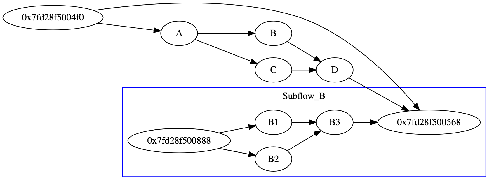

# Spawn a Task Dependency Graph at Runtime

It is very common for a parallel program to 
spawn tasks at runtime.
In Cpp-Taskflow, we call this *dynamic tasking* - 
creating another task dependency graph 
during the execution of a task.
In this tutorial, we are going to demonstrate how to enable dynamic tasking
in Cpp-Taskflow.

+ [Subflow Dependency Graph](#Subflow-Dependency-Graph)
+ [Detach a Subflow Dependency Graph](#Detach-a-Subflow-Dependency-Graph)
+ [Nested Subflow](#Nested-Subflow)

# Subflow Dependency Graph

Dynamic tasks are those created during the execution of a dispatched graph.
These tasks are spawned from a parent task and are grouped together to a 
*subflow* dependency graph.
Cpp-Taskflow has an unified interface for static and dynamic tasking.
To create a subflow for dynamic tasking, emplace a callable 
that takes one argument of type `SubflowBuilder`.
A `SubflowBuilder` object will be created during the runtime and
passed to the task.
All graph building methods you find in taskflow can be also used in a subflow builder.

```cpp
 1: tf::Taskflow tf(4);  // create a taskflow object with four worker threads
 2:
 3: auto A = tf.silent_emplace([] () {}).name("A");  // static task A
 4: auto C = tf.silent_emplace([] () {}).name("C");  // static task C
 5: auto D = tf.silent_emplace([] () {}).name("D");  // static task D
 6:
 7: auto B = tf.silent_emplace([] (tf::SubflowBuilder& subflow) {  // static task B to spawn a subflow
 8:   auto B1 = subflow.silent_emplace([] () {}).name("B1");  // dynamic task B1
 9:   auto B2 = subflow.silent_emplace([] () {}).name("B2");  // dynamic task B2
10:   auto B3 = subflow.silent_emplace([] () {}).name("B3");  // dynamic task B3
11:   B1.precede(B3);  // B1 runs bofore B3
12:   B2.precede(B3);  // B2 runs before B3
13: }).name("B");
14:
15: A.precede(B);  // B runs after A
16: A.precede(C);  // C runs after A
17: B.precede(D);  // D runs after B
18: C.precede(D);  // D runs after C
19:
20: tf.dispatch().get();  // execute the graph without cleanning up topologies
21: std::cout << tf.dump_topologies();
```


Debrief:
+ Line 1 creates a taskflow object with four worker threads
+ Line 3-5 creates three tasks, A, C, and D
+ Line 7-13 creates a task B that spawns a task dependency graph of three tasks B1, B2, and B3
+ Line 15-18 add dependencies among A, B, C, and D
+ Line 20 dispatches the graph and waits until it finishes without cleaning up the topology
+ Line 21 dumps the topology that represents the entire task dependency graph

Line 7-13 is the main coding block to enable dynamic tasking.
Cpp-Taskflow uses a variant date type to unify the interface of static tasking and dynamic tasking.
The runtime will create a *subflow builder* passing it to task B,
and spawn a dependency graph as described by the associated callable.
This new subflow graph will be added to the topology to which its parent task B belongs to.
Due to the property of dynamic tasking,
we cannot dump its structure before execution.
We will need to dispatch the graph first and call the method `dump_topologies`.

# Detach a Subflow Dependency Graph

By default, a spawned subflow joins its parent task.
That is, all nodes of zero outgoing edges in the subflow will precede the parent task.
This forces a subflow to follow the dependency constraints after its parent task.
Having said that,
you can detach a subflow from its parent task, allowing its execution to flow independently.

```cpp
 1: tf::Taskflow tf(4);  // create a taskflow object with four worker threads
 2:
 3: auto A = tf.silent_emplace([] () {}).name("A");  // static task A
 4: auto C = tf.silent_emplace([] () {}).name("C");  // static task C
 5: auto D = tf.silent_emplace([] () {}).name("D");  // static task D
 6:
 7: auto B = tf.silent_emplace([] (tf::SubflowBuilder& subflow) {  // task B to spawn a subflow
 8:   auto B1 = subflow.silent_emplace([] () {}).name("B1");  // dynamic task B1
 9:   auto B2 = subflow.silent_emplace([] () {}).name("B2");  // dynamic task B2
10:   auto B3 = subflow.silent_emplace([] () {}).name("B3");  // dynamic task B3
11:   B1.precede(B3);    // B1 runs bofore B3
12:   B2.precede(B3);    // B2 runs before B3
13:   subflow.detach();  // detach this subflow
14: }).name("B");
15:
16: A.precede(B);  // B runs after A
17: A.precede(C);  // C runs after A
18: B.precede(D);  // D runs after B
19: C.precede(D);  // D runs after C
20:
21: tf.dispatch().get();  // execute the graph without cleanning up topologies
22: std::cout << tf.dump_topologies();
```



The above figure demonstrates a detached subflow based on the example 
in the previous section.
A detached subflow will eventually join the end of the topology of its parent task.

# Nested Subflow

A subflow can be nested or recursive.
You can create another subflow from the execution of a subflow and so on.

```cpp
 1: tf::Taskflow tf;
 2:
 3: auto A = tf.silent_emplace([] (auto& sbf){
 4:   std::cout << "A spawns A1 & subflow A2\n";
 5:   auto A1 = sbf.silent_emplace([] () {
 6:     std::cout << "subtask A1\n";
 7:   }).name("A1");
 8:
 9:   auto A2 = sbf.silent_emplace([] (auto& sbf2){
10:     std::cout << "A2 spawns A2_1 & A2_2\n";
11:     auto A2_1 = sbf2.silent_emplace([] () {
12:       std::cout << "subtask A2_1\n";
13:     }).name("A2_1");
14:     auto A2_2 = sbf2.silent_emplace([] () {
15:       std::cout << "subtask A2_2\n";
16:     }).name("A2_2");
17:     A2_1.precede(A2_2);
18:   }).name("A2");
19:   A1.precede(A2);
20: }).name("A");
21:
22: // execute the graph without cleanning up topologies
23: tf.dispatch().get();
24: std::cout << tf.dump_topologies();
```


Debrief:
+ Line 1 creates a taskflow object
+ Line 3-20 creates a task to spawn a subflow of two tasks A1 and A2
+ Line 9-18 spawns another subflow of two tasks A2_1 and A2_2 out of its parent task A2
+ Line 23-24 dispatches the graph asynchronously and dump its structure when it finishes

Similarly, you can detach a nested subflow from its parent subflow.
A detached subflow will run independently and eventually join the topology
of its parent subflow.


